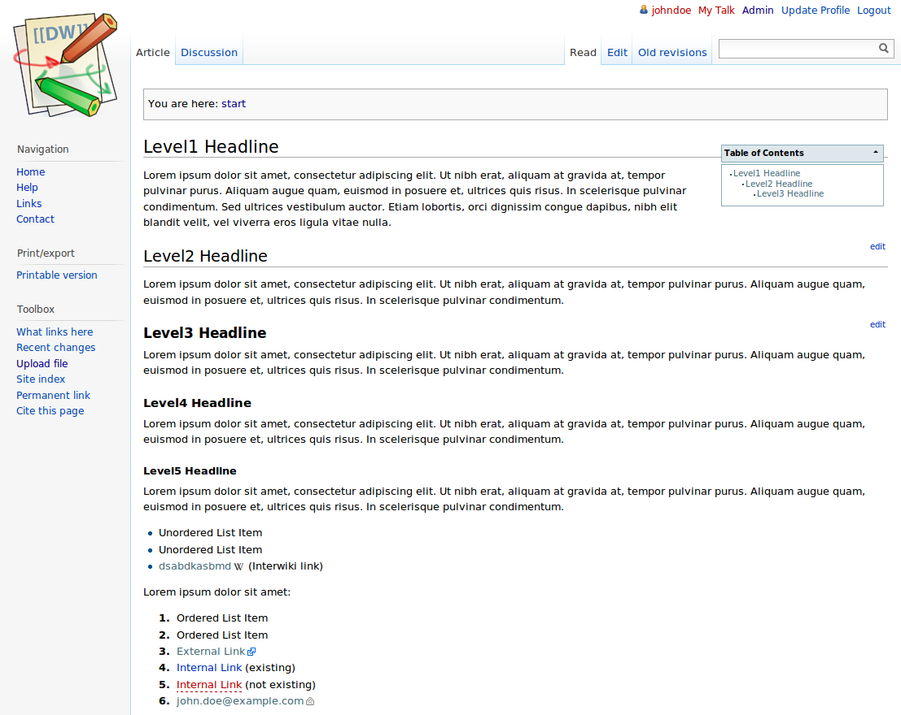

<!--
NOTA: Este README foi creado automáticamente por <https://github.com/YunoHost/apps/tree/master/tools/readme_generator>
NON debe editarse manualmente.
-->

# Dokuwiki para YunoHost

[](https://dash.yunohost.org/appci/app/dokuwiki)  

[](https://install-app.yunohost.org/?app=dokuwiki)

*[Le este README en outros idiomas.](./ALL_README.md)*

> *Este paquete permíteche instalar Dokuwiki de xeito rápido e doado nun servidor YunoHost.*  
> *Se non usas YunoHost, le a [documentación](https://yunohost.org/install) para saber como instalalo.*

## Vista xeral

DokuWiki is a simple to use and highly versatile Open Source wiki software that doesn't require a database. It is loved by users for its clean and readable syntax. The ease of maintenance, backup and integration makes it an administrator's favorite. Built in access controls and authentication connectors make DokuWiki especially useful in the enterprise context and the large number of plugins contributed by its vibrant community allow for a broad range of use cases beyond a traditional wiki.

## YunoHost specific features

* Integrate with YunoHost users and SSO - i.e. logout button
* Allow one user to be the "administrator" (set at the installation)
* Default authorization is set as read only so guest people cannot edit pages. (Especially needed if wiki is public to avoid spam and defacing. Can be changed from admin panel)
* During the upgrade, official plugins are also upgraded. We recommend that you should check that they run properly in the administration panel after the upgrade. We cannot know if some plugins are broken...


**Versión proporcionada:** 2024.02.06a~ynh1

**Demo:** <https://demo.yunohost.org/dokuwiki/doku.php?id=start&do=login&u=demo&p=demo>

## Capturas de pantalla



## Documentación e recursos

- Web oficial da app: <https://www.dokuwiki.org>
- Documentación oficial para admin: <https://www.dokuwiki.org/manual>
- Repositorio de orixe do código: <https://github.com/dokuwiki/dokuwiki>
- Tenda YunoHost: <https://apps.yunohost.org/app/dokuwiki>
- Informar dun problema: <https://github.com/YunoHost-Apps/dokuwiki_ynh/issues>

## Info de desenvolvemento

Envía a túa colaboración á [rama `testing`](https://github.com/YunoHost-Apps/dokuwiki_ynh/tree/testing).

Para probar a rama `testing`, procede deste xeito:

```bash
sudo yunohost app install https://github.com/YunoHost-Apps/dokuwiki_ynh/tree/testing --debug
ou
sudo yunohost app upgrade dokuwiki -u https://github.com/YunoHost-Apps/dokuwiki_ynh/tree/testing --debug
```

**Máis info sobre o empaquetado da app:** <https://yunohost.org/packaging_apps>
