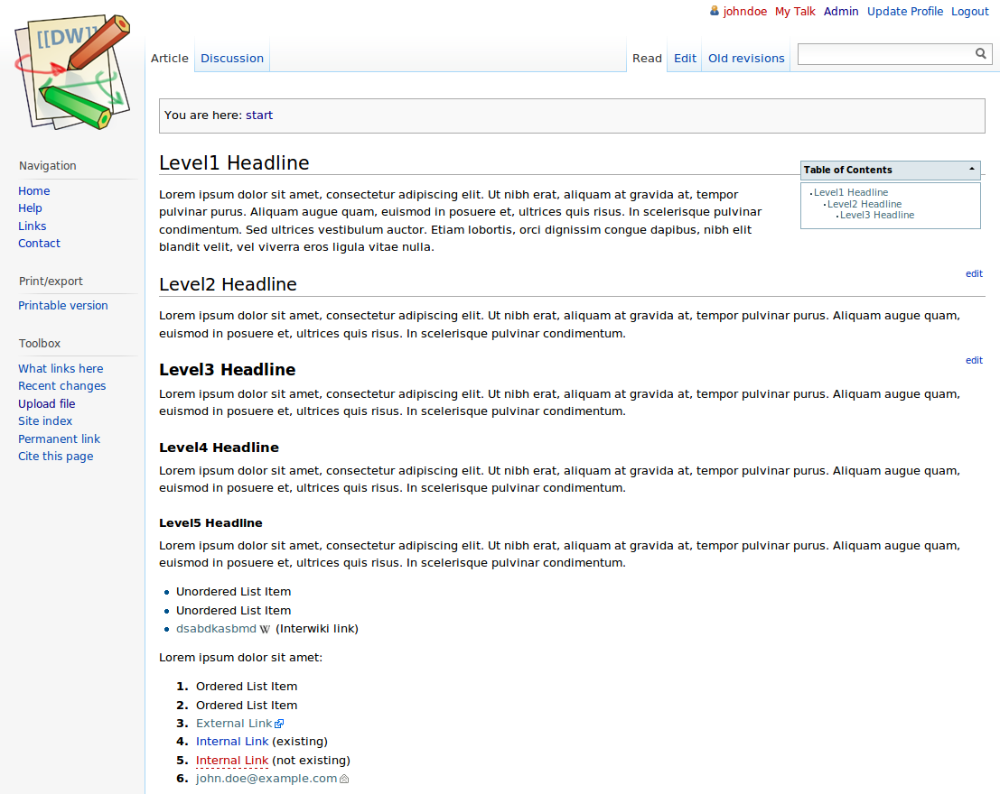

<!--
Важно: этот README был автоматически сгенерирован <https://github.com/YunoHost/apps/tree/master/tools/readme_generator>
Он НЕ ДОЛЖЕН редактироваться вручную.
-->

# Dokuwiki для YunoHost

[](https://ci-apps.yunohost.org/ci/apps/dokuwiki/)  

[](https://install-app.yunohost.org/?app=dokuwiki)

*[Прочтите этот README на других языках.](./ALL_README.md)*

> *Этот пакет позволяет Вам установить Dokuwiki быстро и просто на YunoHost-сервер.*  
> *Если у Вас нет YunoHost, пожалуйста, посмотрите [инструкцию](https://yunohost.org/install), чтобы узнать, как установить его.*

## Обзор

DokuWiki is a simple to use and highly versatile Open Source wiki software that doesn't require a database. It is loved by users for its clean and readable syntax. The ease of maintenance, backup and integration makes it an administrator's favorite. Built in access controls and authentication connectors make DokuWiki especially useful in the enterprise context and the large number of plugins contributed by its vibrant community allow for a broad range of use cases beyond a traditional wiki.

## YunoHost specific features

* Integrate with YunoHost users and SSO - i.e. logout button
* Allow one user to be the "administrator" (set at the installation)
* Default authorization is set as read only so guest people cannot edit pages. (Especially needed if wiki is public to avoid spam and defacing. Can be changed from admin panel)
* During the upgrade, official plugins are also upgraded. We recommend that you should check that they run properly in the administration panel after the upgrade. We cannot know if some plugins are broken...


**Поставляемая версия:** 2024.02.06a~ynh1

**Демо-версия:** <https://demo.yunohost.org/dokuwiki/doku.php?id=start&do=login&u=demo&p=demo>

## Снимки экрана



## Документация и ресурсы

- Официальный веб-сайт приложения: <https://www.dokuwiki.org>
- Официальная документация администратора: <https://www.dokuwiki.org/manual>
- Репозиторий кода главной ветки приложения: <https://github.com/dokuwiki/dokuwiki>
- Магазин YunoHost: <https://apps.yunohost.org/app/dokuwiki>
- Сообщите об ошибке: <https://github.com/YunoHost-Apps/dokuwiki_ynh/issues>

## Информация для разработчиков

Пришлите Ваш запрос на слияние в [ветку `testing`](https://github.com/YunoHost-Apps/dokuwiki_ynh/tree/testing).

Чтобы попробовать ветку `testing`, пожалуйста, сделайте что-то вроде этого:

```bash
sudo yunohost app install https://github.com/YunoHost-Apps/dokuwiki_ynh/tree/testing --debug
или
sudo yunohost app upgrade dokuwiki -u https://github.com/YunoHost-Apps/dokuwiki_ynh/tree/testing --debug
```

**Больше информации о пакетировании приложений:** <https://yunohost.org/packaging_apps>
